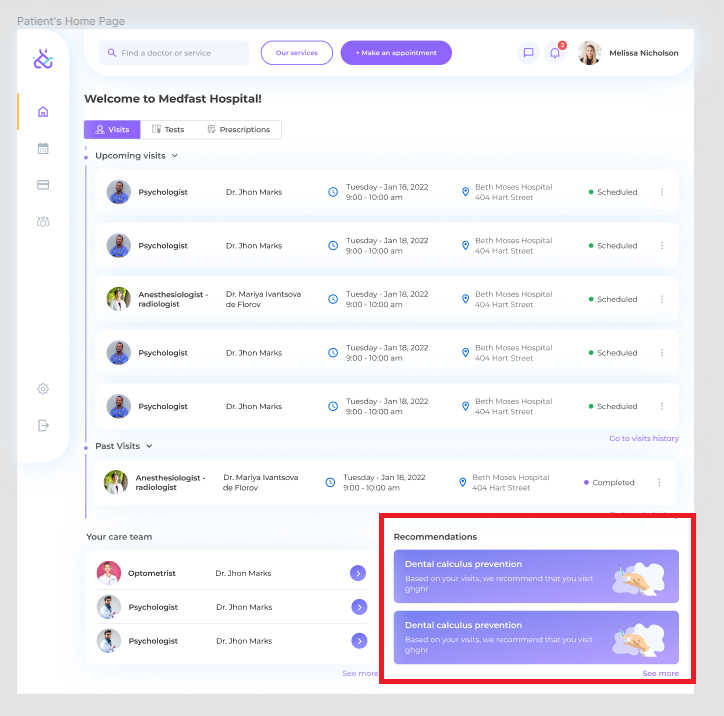

= Appointment Recommendation
:toc: auto

== Description

The widget in the bottom right should show a list of the recommended appointments to have.

Recommendations are generated on the server on `GET /appointments/user/recommendations` requests (https://backend-production-3d82.up.railway.app/api-docs/#/Appointments/get-appointments-user-recommendations).

The backend always returns the same list of recommendations for any request.

The recommendations list should show two or fewer items in the default state.

Clicking the recommendation item is not expected to do anything in the current version.

Clicking the ‘See more’ button will show a modal with a full list of recommendations, clicking an item in the list also is not expected to do anything in the current version.

On narrow screens recommendations list should go under the ‘Your Care Team’ widget.

== Open Questions

=== What should happen when the user clicks one of the items?

I’d expect it to start the ‘Create an appointment’ flow. As we don’t have I think we can just do nothing on click.

=== What should happen when the user clicks on the ‘See more’?

I’d expect it to show a modal containing the rest of the recommendations. Also, I think it doesn’t make sense to show the ‘See more’ button if the user has only 2 recommendations.

=== How do we want to generate a list of the recommendations?

I think it makes sense to base recommendations generation on the history of the visits. As we don’t have appointment functionality yet, for now, we can return the same list for any request.

=== Do we expect to have an empty state?

=== Do we expect to have loading, and error states for the recommendations list?
