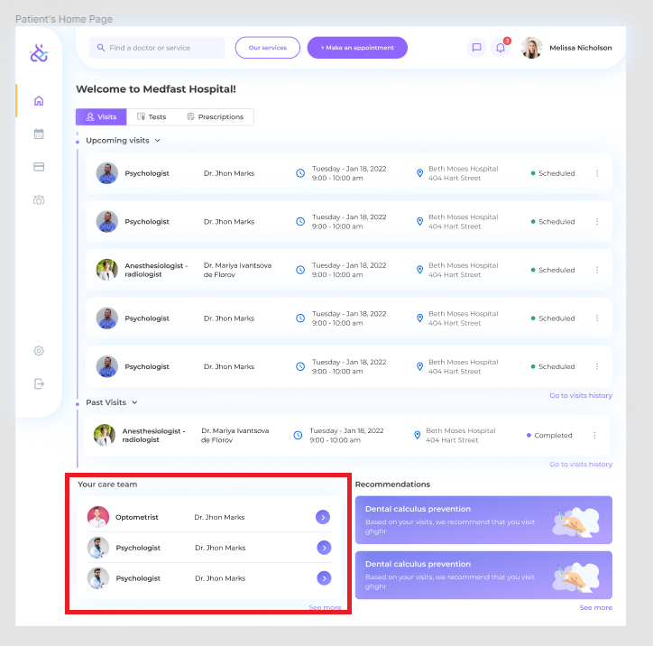

= Your Care Team
:toc:

== Description

The homepage should contain a list of your doctors.

Doctors are generated on the server on `GET /users/{userId}/doctors` requests (https://backend-production-3d82.up.railway.app/api-docs/#/Users/get-users-userId-doctors).

For now, the backend always returns the same list of doctors.

Each list item should contain the doctor’s avatar, specialization, and full name.

The doctors list should show three or fewer items in the default state.

Clicking the ‘>’ button in the list item is not expected to do anything in the current version.

Clicking the ‘See more’ button should show the modal with a list of all related doctors.

== Open Questions

=== Which doctors should return the backend?

In my opinion, it makes sense to return a list of doctors from your appointment history. As we don’t have it now, I think it’s fine to always return the same doctors list.

=== What should happen when the user clicks the ‘>’ button?

=== Do we want to have loading and error states?
